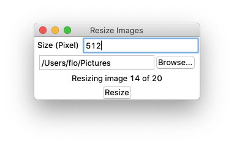

# Resize Tool
A very simple tool to resize multiple images


## Try it 
You need to have python3 installed (at least 3.5)

Then install the dependencies
```bash
pip3 install pillow
````

And start the script
```bash
python3 main.py
```

## Note 
I only tested it on macOS with python 3.8. The script should work on Linux,
macOS and Windows with python version >= 3.5.
If you experience any problems feel free to open an issue.
